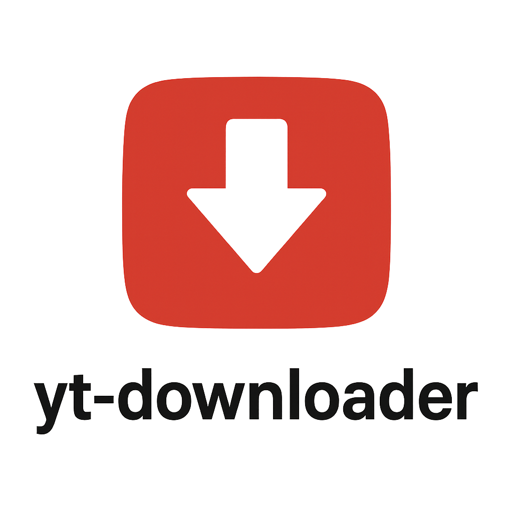

# yt-downloader

[](https://github.com/ytget/yt-downloader/actions/workflows/build.yaml)
[](https://goreportcard.com/report/github.com/ytget/yt-downloader)
[](https://github.com/ytget/yt-downloader)
[](https://github.com/ytget/yt-downloader/releases)
[](https://opensource.org/licenses/MIT)
[](https://github.com/ytget/yt-downloader)
[](https://github.com/ytget/yt-downloader/issues)
[](https://github.com/ytget/yt-downloader/stargazers)

Lightweight cross‑platform desktop app to download YouTube videos and playlists with a clean Fyne UI and robust native Go integration.

<div align="center">
    
</div>

### Quick links
- [Quick start](#quick-start)
- [Usage](#usage)
- [Screenshots](#screenshots)
- [Configuration](#configuration-in-app-settings)
- [Architecture overview](#architecture-overview)
- [Download configuration](#download-configuration)
- [Development](#development-makefile-driven)
- [Troubleshooting](#troubleshooting)
- [Contributing](#contributing)

### Table of contents
- [What is this?](#what-is-this)
- [Purpose](#purpose)
- [Features](#features)
- [Screenshots](#screenshots)
- [Supported platforms](#supported-platforms)
- [Architecture overview](#architecture-overview)
- [Requirements](#requirements)
- [Installation](#installation)
- [Quick start](#quick-start)
- [Usage](#usage)
- [Configuration (in-app Settings)](#configuration-in-app-settings)
- [Download configuration](#download-configuration)
- [Development (Makefile driven)](#development-makefile-driven)
- [Troubleshooting](#troubleshooting)
- [Diagnostics and issue reporting](#diagnostics-and-issue-reporting)
- [FAQ](#faq)
- [Legal note](#legal-note)
- [Open Source & License](#open-source--license)
- [Roadmap (high level)](#roadmap-high-level)
- [Contributing](#contributing)
- [Acknowledgements](#acknowledgements)
- [License](#license)

### What is this?
yt-downloader is a GUI application written in Go using the Fyne toolkit. It downloads single videos and entire playlists from YouTube, shows live progress, and stores files in your Downloads folder by default.

### Purpose
- Provide a simple, reliable, cross‑platform YouTube downloader with a friendly UI.
- Handle large playlists quickly using native Go parsing.
- Offer sensible defaults with options for power users (quality presets, filename template, parallelism, language, auto-reveal on complete).

### Features
- Best‑effort resilient downloads (continue, no-overwrite behavior).
- Playlist parsing via native Go engine for speed and stability.
- Live progress, speed, ETA; per-item Start/Pause/Stop, Open/Reveal, Copy path, Remove.
- Parallel downloads with configurable limit.
- File naming template and quality presets (best/medium/audio).
- Notifications on completion with quick actions.
- Localization: System, English, Русский, Português.
- Cross‑platform (macOS, Linux, Windows) using Fyne.

### Screenshots

#### Desktop (macOS, Linux, Windows)

<div align="center">
  <p><strong>Playlist downloading with live progress tracking</strong></p>
  
  <br/><br/>
  <p><strong>Settings dialog with quality presets and localization</strong></p>
  
</div>

#### Mobile (Android)

<div align="center">
  <p><strong>Completed downloads list</strong></p>
  
  <br/><br/>
  <p><strong>Download in progress with speed and ETA</strong></p>
  
  <br/><br/>
  <sub>Screens may vary slightly depending on OS and theme.</sub>
</div>

### Supported platforms
- macOS 12+
- Linux (X11/Wayland)
- Windows 10/11
- Android 7.0+ (arm, arm64)

### Architecture overview
- UI: Fyne (`internal/ui`) with a unified playlist view and task rows.
- Downloads: `github.com/ytget/ytdlp` (pure Go engine) for single videos and playlists.
- All processing handled by native Go library without external dependencies.
- Settings: stored via Fyne preferences; sane defaults with runtime changes.

### Requirements
- Go (matching `go.mod`, currently 1.24.x).
- No external dependencies required for core functionality (all handled by pure Go engine).
  - Optional but recommended: `ffmpeg` installed in PATH for muxing/format conversions.

### Installation
- Clone the repo and run the application.
- The app runs without additional system services. All dependencies are Go modules; UI uses Fyne.
- Install binary into your Go bin:

```
make install
```

- Install dependencies:

```
make deps
```

### Quick start
1) Install dependencies:
2) Run the app:

```
make run
```

3) Paste a YouTube URL (single video or a playlist with `list=`) and press Download.

### Usage
- Single video: paste the video URL and click Download.
- Playlist: paste a URL containing `list=`; the app parses the list in background and then starts downloads (auto-start can apply).
- Each item exposes actions: Start/Pause, Stop, Reveal in Finder/Explorer, Open, Copy path, Remove.

### Configuration (in-app Settings)
- Download directory: defaults to the system Downloads folder.
- Max parallel downloads: bounded to a safe range.
- Quality preset: best, medium, audio.
- Filename template: defaults to `%(title)s.%(ext)s`.
- Language: System/English/Русский/Português.
- Auto reveal on complete: open file location automatically after download.

### Download configuration
For playlists and single videos, the app uses the native Go engine:
- Fast playlist parsing with native Go implementation
- Progressive download with resume capability
- Continue partial downloads, avoid overwriting final files, prefer best MP4/WebM, and stream frequent progress updates for the UI.

### Development (Makefile driven)
Common tasks are exposed via the Makefile. See all commands:

```
make help
```

Key targets:
- `run`: Run application (entrypoint `cmd/yt-downloader/main.go`).
- `build`: Build binary to `bin/yt-downloader`.
- `test`: Run tests.
- `lint`: Run golangci-lint.
- `format`: Apply goimports formatting.
- `deps`: Download/tidy modules.
- `deps-update`: Update modules.
- `clean`: Remove build artifacts.
- `docker-run` / `docker-stop`: Run/stop via docker-compose.
 - `debug`: Run app and tee logs to `debug.log` (useful for bug reports).

Aliases:
- `r` -> run, `t` -> test, `l` -> lint, `f` -> format, `dr` -> docker-run, `ds` -> docker-stop.

### Troubleshooting
- Download issues: ensure network connectivity and valid URLs.
- Playlist returns 0 items: verify the URL contains `list=`; some Mix/autoplay lists are special but still supported when `list=` is present.
- Progress not showing 100%: for rare cases with unknown total size, completion will still flip the status to Completed.
- macOS Gatekeeper: you may need to allow the app/network access depending on your environment.

### Diagnostics and issue reporting
When reporting a bug, please include:
- Your OS and version, Go version.
- Example URL(s) that reproduce the issue (video or playlist with `list=`).
- Full app logs captured from a terminal session.

How to capture logs:

```
make debug
# or manually
make run 2>&1 | tee debug.log
```

Before filing an issue, please:
- Ensure you are using the latest version of the application.
- Search existing issues to avoid duplicates.
- Provide clear steps to reproduce and expected vs actual behavior.

### Roadmap (high level)
- More granular quality/format selection.
- Persistent task history and resume between sessions.
- Export/import playlist queues.
- Theming and additional locales.

### FAQ
- Why no external dependencies? — The app uses a native Go engine for maximum compatibility and performance.
- How do I update the app? — Pull the latest changes and rebuild, or download the latest release.
- Where are files saved? — By default to the system Downloads folder; you can change it in Settings.

### Legal note
This tool is intended for downloading content you have the rights to access. Respect platform Terms of Service and local laws.

### Open Source & License
- Purpose: deliver a friendly, cross‑platform GUI for downloading videos/playlists using Fyne and native Go engine, with focus on stability and UX.
- License: MIT (see `LICENSE`).
- Versioning: SemVer; releases are cut from tags `v*` (e.g., `v1.2.3`).
- Transparency: roadmap and changes via GitHub Issues/PRs and release notes.
- Security: report vulnerabilities privately (e.g., GitHub security advisories).

### Contributing
We welcome community contributions. Please follow the guidelines below.

- Requirements
  - Go: version from `go.mod`.
  - All dependencies handled via Go modules.
  - Recommended: `ffmpeg` in `PATH` for muxing/format conversions.

- Quick start (development)
  - Install dependencies: `make deps`
  - Run the app: `make run` (or `make debug` to tee logs)
  - Tests and lint: `make test` and `make lint`
  - Compile binary: `make build` (outputs to `bin/`)

- Branches and commits
  - Branches: `feature/<ticket-or-topic>`, `hotfix/<ticket>`, `release/<version>`
  - Commits: Conventional Commits + task ID when applicable. Example:
    - `feat(PRJCT-13121): worker - fix time intervals (stability)`
  - Keep messages short, in English.

- Code style and rules
  - Avoid `panic`; avoid `reflect`, `runtime`, `any/interface{}`; generics only when clearly justified.
  - Propagate storage/database errors upward; do not swallow errors.
  - Prefer `strings.Builder` for concatenation; for simple logs use `fmt.Sprintf`.
  - Use clear names; early returns; explicit error handling.
  - Formatting: `make format`; linting: `make lint`.

- PR checklist
  - `make lint` and `make test` are green.
  - No unnecessary files/artifacts committed (`bin/`, `dist/`, `fyne-cross/` are ignored).
  - Changes are focused and well-described in the PR.

- How PRs are validated (CI)
  - Workflow: `.github/workflows/build.yaml`
    - Triggers: `pull_request` and `push` to `main`, `release/**`, `hotfix/**`, `feature/**` (docs are ignored via `paths-ignore`)
    - Steps: `make lint`, `make test`, quick compile check `make build`
    - `concurrency` cancels outdated runs on new pushes to the same ref
  - Releases: `.github/workflows/release.yaml` (on tags `v*`)
    - Cross-builds (Linux/Windows/Android/macOS), artifact aggregation
    - Version embedded from tag: `-ldflags -X main.version=${GITHUB_REF_NAME#v}`
    - `SHA256SUMS.txt` generated and attached to GitHub Release

- How to help
  - Report issues with logs (`make debug`), OS/Go versions, and reproducible URLs.
  - Propose improvements: UX, localization, tests, docs.
  - Smaller PRs are easier to review.

- Code of Conduct
  - Be respectful. Friendly, focused collaboration is appreciated.

### Acknowledgements
- `github.com/ytget/ytdlp` — native Go YouTube download engine.
- `Fyne` — cross‑platform UI.
- Pure Go implementation for maximum compatibility.
- Inspiration from [`youtube-dl`](https://github.com/ytdl-org/youtube-dl) project and its excellent documentation structure.

### License
MIT License

Copyright (c) 2025 yt-downloader contributors

Permission is hereby granted, free of charge, to any person obtaining a copy
of this software and associated documentation files (the "Software"), to deal
in the Software without restriction, including without limitation the rights
to use, copy, modify, merge, publish, distribute, sublicense, and/or sell
copies of the Software, and to permit persons to whom the Software is
furnished to do so, subject to the following conditions:

The above copyright notice and this permission notice shall be included in all
copies or substantial portions of the Software.

THE SOFTWARE IS PROVIDED "AS IS", WITHOUT WARRANTY OF ANY KIND, EXPRESS OR
IMPLIED, INCLUDING BUT NOT LIMITED TO THE WARRANTIES OF MERCHANTABILITY,
FITNESS FOR A PARTICULAR PURPOSE AND NONINFRINGEMENT. IN NO EVENT SHALL THE
AUTHORS OR COPYRIGHT HOLDERS BE LIABLE FOR ANY CLAIM, DAMAGES OR OTHER
LIABILITY, WHETHER IN AN ACTION OF CONTRACT, TORT OR OTHERWISE, ARISING FROM,
OUT OF OR IN CONNECTION WITH THE SOFTWARE OR THE USE OR OTHER DEALINGS IN THE
SOFTWARE.

## Build artifacts and release structure

This project supports two build paths:
- Local builds (native toolchain)
- Cross-platform builds via Docker using fyne-cross

### Output directories
- `bin/`: native binaries built by `make build` (current host only).
- `fyne-cross/dist/<target>/`: release-ready packages produced by fyne-cross (e.g. `linux-amd64/dist.tar.xz`, `windows-amd64/dist.zip`, `android-*/dist.apk`).
- `fyne-cross/bin/<target>/`: raw binaries produced by fyne-cross (if available).
- `dist/`: aggregated artifacts for publishing; populated by `make collect-artifacts`.
- `dist/darwin-local/`: zipped local macOS `.app` bundles.

### Common tasks
- Cross-build (Docker required):
  - Linux amd64: `make build-linux-amd64`
  - Windows amd64: `make build-windows-amd64`
  - Android (all ABIs): `make build-android`
- Local macOS packaging (on macOS):
  - macOS `.app`: `make package-darwin`
- Aggregate all outputs into `dist/`:
  - `make collect-artifacts`

Version embedding: all builds inject version with `-ldflags -X main.version=<value>` (auto-populated from `git describe` in Makefile).

### CI (GitHub Actions) recommendations
- Build using the same targets as above (Linux/Windows/Android on `ubuntu-latest`; macOS/iOS on `macos-latest` if needed).
- Upload artifacts from `fyne-cross/dist/**` (and optionally `dist/**` if you aggregate locally in workflow).
- Attach the same artifacts to GitHub Releases triggered by tags `v*`.

Example artifact globs:
- `fyne-cross/dist/**`
- `dist/**` (if `make collect-artifacts` is used in CI)
